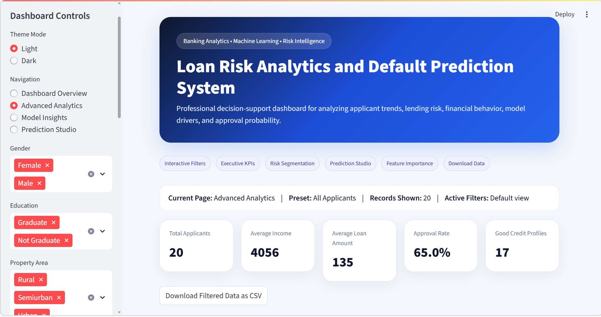
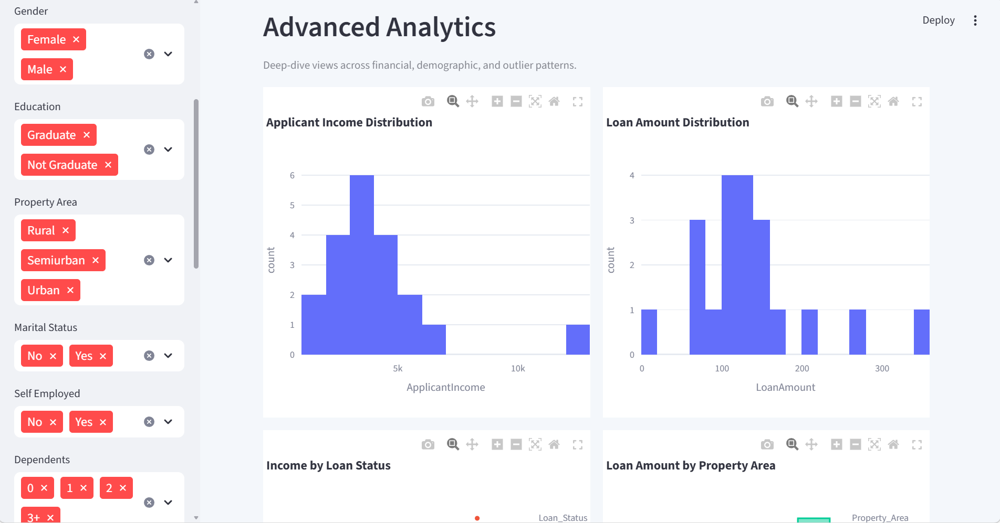

<h1 align="center">Loan Risk Analytics & Default Prediction System</h1>

A data-driven banking analytics dashboard for analyzing loan applicant behavior, 
identifying risk patterns, and predicting loan approval using machine learning.

<h2>Overview</h2>

This project is an end-to-end analytics and prediction system designed to simulate 
real-world loan approval workflows. It combines data preprocessing, exploratory analysis, 
risk segmentation, and machine learning to support better financial decision-making.

<h2>Dashboard Preview</h2>

<h3>Dashboard Overview</h3>

  

<h3>Advanced Analytics</h3>

  

<h3>Prediction Studio</h3>

  

<h2>Core Features</h2>
<ul>
  <li>Interactive dashboard with dynamic filtering</li>
  <li>Loan approval and rejection trend analysis</li>
  <li>Risk segmentation (Low, Medium, High)</li>
  <li>Income and loan distribution insights</li>
  <li>Demographic analysis</li>
  <li>Correlation heatmap</li>
  <li>Feature importance visualization</li>
  <li>Machine learning-based prediction with probability</li>
</ul>

<h2>Machine Learning</h2>
<ul>
  <li>Model: Random Forest Classifier</li>
  <li>Task: Loan Approval Prediction</li>
  <li>Target: Loan_Status</li>
</ul>

<h2>Technology Stack</h2>
<ul>
  <li>Python</li>
  <li>Streamlit</li>
  <li>Pandas</li>
  <li>Plotly</li>
  <li>Scikit-learn</li>
</ul>

<h2>Project Structure</h2>

<pre><code>
loan-risk-analysis/
│
├── data/
├── assets/
├── app.py
├── model_training.py
├── model.pkl
├── encoders.pkl
├── requirements.txt
└── README.md
</code></pre>

<h2>Run the Project</h2>

<pre><code>
pip install -r requirements.txt
python model_training.py
streamlit run app.py
</code></pre>

Interactive analytics system for financial risk decision support.

